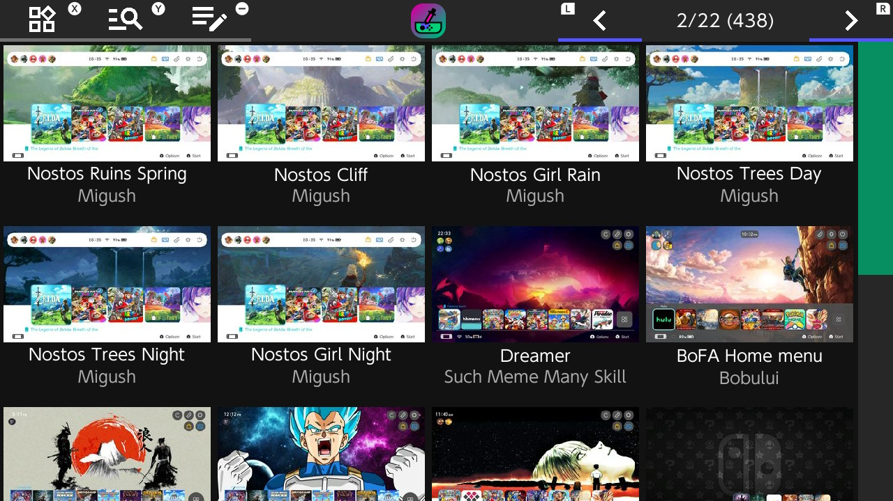

# themezer-nx
A switch theme downloader that pulls from https://themezer.net/, and installs themes using the NXThemesInstaller

## How to use
1. Download the latest nro release in the [releases tab](https://github.com/suchmememanyskill/themezer-nx/releases) and put it in the switch folder 
2. Download the latest [NXThemesInstaller.nro](https://github.com/exelix11/SwitchThemeInjector/releases) and put it in the switch folder, if you haven't already. (The releases from the appstore should work as well)
3. Make sure your switch is connected to the internet (if you're looking to connect online without connecting to nintendo, see [90DNS](https://nh-server.github.io/switch-guide/extras/blocking_updates/))
4. Open the app in the homebrew menu

## "Installing" a Theme
When you select "Install theme" the app will queue the install until you exit via + or via the 'exit themezer-nx' button inside the target menu. Then themezer-nx opens the NXThemesInstaller to install your selected theme(s) after it exits.

## Support
For support you can go to the [Themezer discord](https://discord.gg/bBCw6tF)

## Credits
- [Exelix11](https://github.com/exelix11) for helping me with cURL and being awesome in general
- [cJSON](https://github.com/DaveGamble/cJSON) For the json lib used in this project